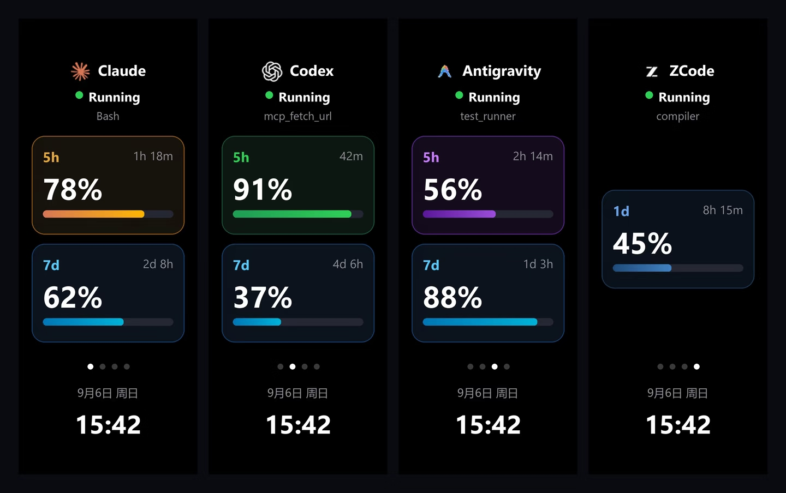
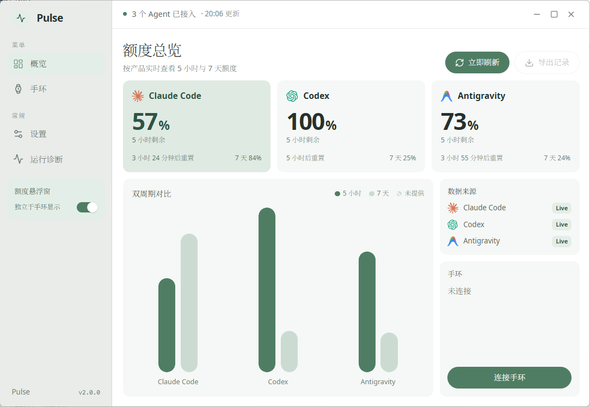

# Pulse

Pulse 是一个 Windows 桌面应用，用于把 Claude Code、Codex、Antigravity 的会话状态和额度显示在小米手环 10 上，同时提供桌面额度悬浮窗。

<p align="center">
  
</p>

> 本项目为个人项目，按现状提供，不承诺 issue 响应和长期维护。

---

## 运行要求

| 项目 | 说明 |
|---|---|
| 小米手环 10 | 仅在 Band 10 上开发和验证 |
| 安卓手机 | 用于绑定手环和导出日志。iOS 未验证 |
| Windows 10 / 11 电脑 | 需要蓝牙。Pulse 桌面端与 `pulse-core` 在本机运行 |

小米手环 10 不能直接联网。Pulse 内置 `pulse-core`，通过蓝牙连接手环，负责安装快应用和表盘，并为手环提供数据。电脑上只需要安装 Pulse。

> 注意：小米手环 10 同一时间只能连接一个设备。Pulse 连接手环后，手环与小米运动健康的连接会断开。连接电脑前需要在手环上选择「连接新手机」；切回手机时需要在小米运动健康中重新连接。

没有小米手环 10 时，Pulse 可以只作为桌面额度悬浮窗使用。

---

## 快速上手

1. 从 [Releases](../../releases/latest) 下载 `Pulse-Setup-2.0.4.exe`（如有更新版本，下载最新版本）并安装。
2. 打开 Pulse，进入「设置」→「检测 Agent 接入」，在 Claude Code 一行点击「修复」安装 hook，然后重新打开 Claude Code 会话。
3. 按照 [docs/手环配对指南.md](docs/手环配对指南.md) 完成手环配置。

Pulse 启动时不会自动连接手环，需要在「手环」页点击「连接手环」。从托盘退出 Pulse 时会同时停止 `pulse-core`。

遇到问题请参考 [docs/故障排查.md](docs/故障排查.md)。

---

## 功能



- **会话状态**：Claude Code 通过 hook 上报会话和工具调用；Codex 通过监听会话文件识别；Antigravity 通过轮询本地服务识别。各自的更新延迟见[故障排查](docs/故障排查.md#会话状态的更新延迟)。
- **额度**：显示 Claude / Codex / Antigravity 的 5 小时与 7 天用量窗口，电脑和手环上均可查看。
- **手环显示**：`pulse-core` 通过蓝牙连接手环，将状态和额度发送到手环上的 Pulse 快应用。
- **配置向导**：包含导入手机日志、连接手环、安装手环应用、验证额度 4 个步骤。密钥从日志中自动提取。
- **表盘管理**：查看手环上已安装的表盘，切换表盘，安装本地 `.bin` 表盘文件，自动提取表盘预览图。
- **快应用安装**：安装内置的 Pulse 快应用，或推送其他 `.rpk` 文件到手环。
- **运行诊断**：检查本机服务、设备守护进程、手环连接、hook 和额度数据，生成脱敏的诊断报告。
- **Hook 安装**：自动写入 `~/.claude/settings.json` 并备份原文件。转发脚本使用 Pulse 自带的运行时执行，不需要单独安装 Node.js。

## 额度悬浮窗

悬浮窗（MiniBar）停靠在屏幕边缘，显示各 Agent 的当前状态和剩余额度，可拖动到任意边缘，点击后展开详情。在「设置」中可以开关悬浮窗，并设置启动时停靠在左侧、右侧或上次的位置。悬浮窗不依赖手环。

<p align="center">
  
</p>

---

## 隐私与网络

- 本地状态服务只监听 `127.0.0.1:8765`，不对局域网开放。
- 手机日志只在本机解析，临时解压的文件在解析后删除，不会上传。
- 手环的蓝牙地址和密钥保存在本机 `%LOCALAPPDATA%\PulseDev\run\device.json`，仅供 `pulse-core` 连接手环使用，不会上传，不会显示在界面和诊断报告中。

---

## 已知限制

- 手环快应用与表盘功能仅在作者的小米手环 10 上验证过。安装失败或无法打开时，请在 issue 中附上「运行诊断」生成的报告。
- 密钥提取流程基于安卓版小米运动健康 / 小米健康研究，iOS 的日志导出方式未验证。
- 在小米运动健康中重新绑定手环后，密钥会更换，需要重新导入日志。

---

## 从源码构建

需要 Node.js 24 和 Rust 工具链（`rustup`）。

```bash
npm install
cd core && cargo build --release && cd ..   # 编译 pulse-core，打包时会包含在安装包中
npm run dist                                # 输出到 release/
```

手环端（可选，需要 [aiot-toolkit](https://www.npmjs.com/package/aiot-toolkit)）：

```bash
cd band-app && npm install && npm run build
```

---

## 赞赏

在 Pulse 的「设置」→「版本与环境」中点击「赞赏」可以查看赞赏码。

## 致谢

- [wxtsky/CodeIsland](https://github.com/wxtsky/CodeIsland)（MIT）：本项目的灵感与部分设计来源。

## 许可证

MIT
