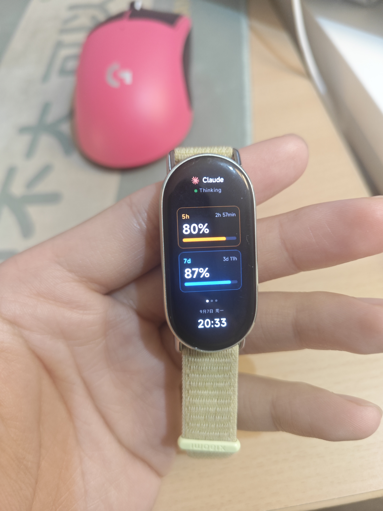

# Pulse

把 Claude Code、Codex、Antigravity 的实时工作状态和额度推到你的**小米手环 10** 上。

抬手就能看见 AI 在跑哪个工具、跑了多久、额度还剩多少——不用切回电脑，不用盯着屏幕等。

<p align="center">
  
</p>

> 个人项目，按现状提供。不保证响应 issue，不保证长期维护。

---

## 先看你能不能用

小米手环 10 本身无法联网。Pulse 内置 `pulse-core`，直接通过蓝牙连接手环、安装应用和表盘、为手环代取数据。**电脑上只需要安装 Pulse 一个软件。**

| 需要 | 说明 |
|---|---|
| 小米手环 10 | 只在 Band 10 上做过开发和验证 |
| 一台安卓手机 | 用来绑定手环并导出日志取密钥。**iOS 未验证** |
| 带蓝牙的 Windows 10 / 11 电脑 | Pulse 桌面端与 `pulse-core` 在本机运行 |
| 一点耐心 | 最难的一步是从手机导出日志，Pulse 会自动从里面取出密钥 |

> ⚠️ **重要：连接 Pulse 会断开手环与小米运动健康的蓝牙连接。** 小米手环 10 同一时间只能连一个设备。连电脑前要在手环上选「连接新手机」；回到手机时要在小米运动健康里重新连接。

**如果你没有小米手环 10**，Pulse 仍然可以当桌面额度悬浮窗用（见下面「额度悬浮窗」一节），但那不是这个项目的重点。

---

## 快速上手

1. 从 [Releases](../../releases/latest) 下载 `Pulse-Setup-2.0.0.exe`（有更新版本就下最新的）并安装。
2. 打开 Pulse →「设置」→「检测 Agent 接入」→ Claude Code 一行点 **「修复」** 安装 hook，然后重开一个 Claude Code 会话。此时悬浮窗已经能动了。
3. 手环部分照着 **[docs/手环配对指南.md](docs/手环配对指南.md)** 做：手机上导出日志，然后在 Pulse 的配置向导里走完 4 步。

> Pulse 启动时不会自动连接手环。需要使用手环时，在「手环」页点击「连接手环」；从托盘退出 Pulse 会停止 `pulse-core`。

卡住了先看 **[docs/故障排查.md](docs/故障排查.md)**。

---

## 它做了什么

- **实时状态**：Claude Code 通过 hook 即时上报会话与工具调用；Codex 监听会话文件；Antigravity 轮询本地服务。三者的延迟差异见[故障排查](docs/故障排查.md#会话状态多久才更新哪些是设计哪些是故障)。
- **额度**：Claude / Codex / Antigravity 的 5 小时与 7 天用量窗口，电脑和手环上都能看。
- **推到手环**：内置 `pulse-core` 直接连接手环，把状态和额度送到手环上的 Pulse 快应用。
- **配置向导**：导入手机日志 → 连接手环 → 安装手环应用 → 验证额度，4 步走完。密钥自动从日志里提取。
- **表盘管理**：查看手环上已安装的表盘、一键切换、安装本地 `.bin` 表盘，并自动提取表盘预览图。
- **推送快应用**：内置的 Pulse 快应用一键安装；也可以拖入其他 `.rpk` 推送到手环。
- **运行诊断**：一键检查设备守护进程与链路状态，诊断报告脱敏后可直接复制，方便提 Issue。
- **一键接入**：hook 安装自动写好 `~/.claude/settings.json` 并备份原文件，用 Pulse 自带的运行时执行转发脚本，**不需要另外安装 Node.js**。

## 额度悬浮窗（附加）

Pulse 同时提供一个桌面悬浮窗（MiniBar）：停靠在屏幕边缘，显示各 Agent 的当前状态和剩余额度；可拖到任意边缘，点击展开详情。在「设置」里可以开关，并选择启动时停靠在左侧、右侧或记住上次位置。不需要手环也能用。


---

## 隐私与网络

- Pulse 的本地状态服务只监听 `127.0.0.1:8765`，**不对局域网开放**。同一个 WiFi 下的其他人看不到你的会话数据。
- 导入手机日志时只在本机解析，临时解压的副本用完立即删除，**不联网上传**。
- 手环的蓝牙地址和密钥保存在本机 `%LOCALAPPDATA%\PulseDev\run\device.json`，只供 `pulse-core` 连接手环使用，不会上传，也不会出现在界面和诊断报告里。

---

## 已知限制

- **手环端的 `.rpk` 与表盘功能只在作者本人的小米手环 10 上验证过。** 如果安装失败或打不开，请附上 Pulse「运行诊断」生成的脱敏报告。
- 第一次配置时，手环需要先出现在 Windows 蓝牙设备列表里（在 Windows 蓝牙设置里配对一次）。之后的连接都在 Pulse 里完成，不再弹 Windows 配对框。
- 取密钥的流程基于安卓版小米运动健康 / 小米健康研究。**iOS 的日志导出路径未验证。**
- 每次在小米运动健康里重新绑定手环，密钥都会更换，需要重新导入一次日志。

---

## 从源码构建

需要 Node.js 24 和 Rust 工具链（`rustup`）。

```bash
npm install
cd core && cargo build --release && cd ..   # 编译 pulse-core，安装包会把它打进去
npm run dist                                # 产物在 release/
```

手环端（可选，需要 [aiot-toolkit](https://www.npmjs.com/package/aiot-toolkit)）：

```bash
cd band-app && npm install && npm run build
```

---

## 支持作者

Pulse 免费开源。觉得好用的话，可以在 Pulse 的「设置」→「版本与环境」里点「赞赏」。

## 致谢

- **[wxtsky/CodeIsland](https://github.com/wxtsky/CodeIsland)**（MIT）——本项目的灵感与部分设计来源。

## 许可证

MIT
