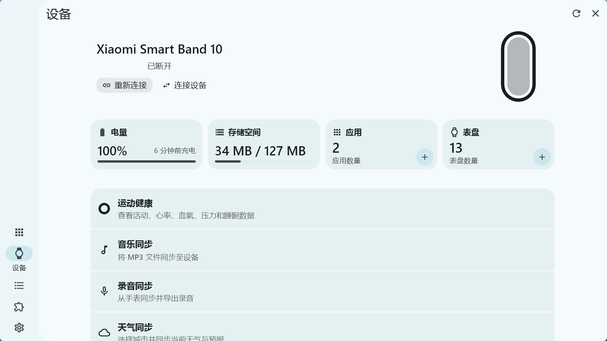
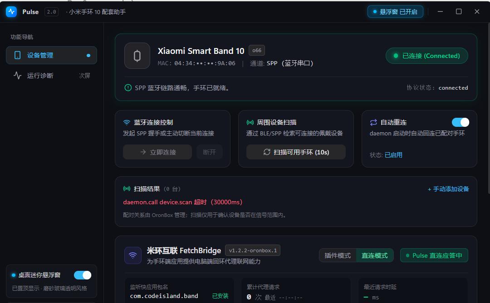
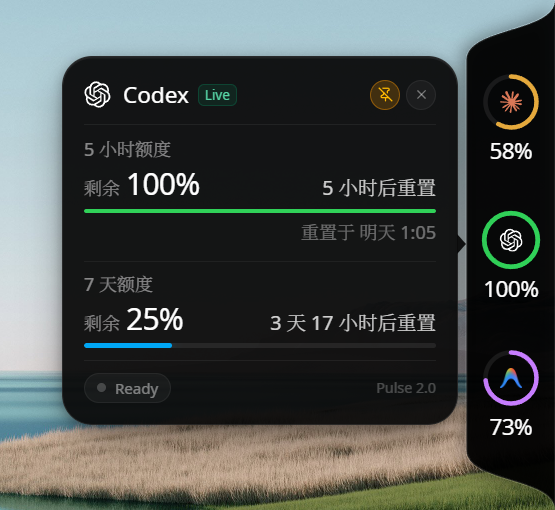
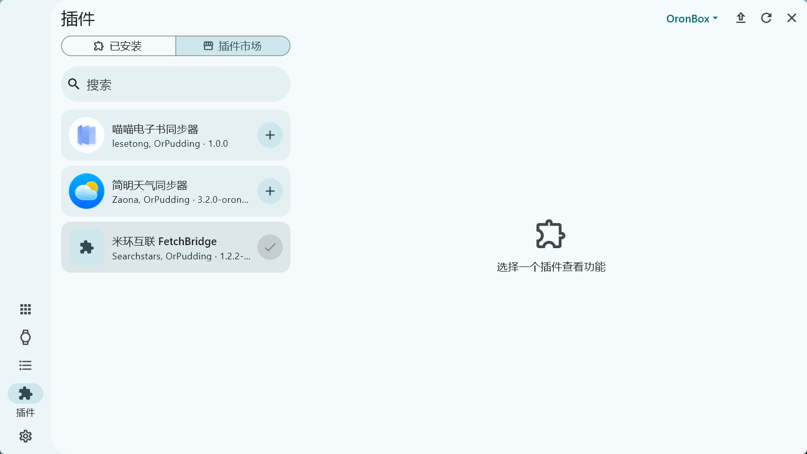
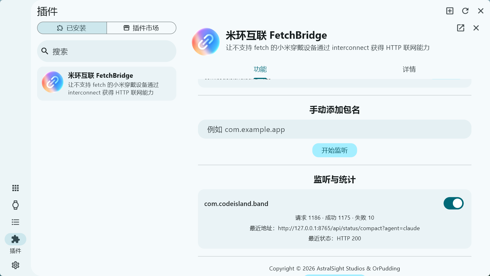

# 手环配对指南

从零到手环上能看见 Claude Code 的状态，一共 7 步。顺利的话 20–30 分钟。

**最难的是第 2–3 步（取 authkey）。Pulse 把这一步做成了「拖个文件进去」，不用你手动翻日志。**

> 全程用到四个软件：手机上的**小米运动健康**和**小米健康研究**，电脑上的 **OronBox** 和 **Pulse**。
>
> Pulse 采用纯手动连接。打开 Pulse 不会启动 OronBox 或抢占蓝牙；只有你点击“连接手环”时才会按需启动后台服务。

---

## 第 0 步：装好前置

| 装什么 | 装在哪 | 说明 |
|---|---|---|
| 小米运动健康 | 安卓手机 | 用来绑定手环。已经在用就跳过 |
| 小米健康研究 | 安卓手机 | **只用来导出日志**，取完密钥就可以卸载 |
| [OronBox](https://github.com/zxor-org/OronBox/releases/tag/v1.1.3) | Windows 电脑 | 负责和手环通信。装完先打开一次，让它生成运行时文件 |
| Pulse | 同一台 Windows 电脑 | 从 [Releases](../../releases) 下载安装 |

⚠️ **Pulse 和 OronBox 必须装在同一台电脑上**——Pulse 要读 OronBox 的本地令牌才能和它通信。

---

## 第 1 步：用小米运动健康绑定手环

扫手环上的二维码，正常绑定。已经绑好的直接进下一步。

> 每次重新绑定，手环的 authkey 都会换一把。所以**先取密钥，再做第 4 步**。

---

## 第 2 步：导出日志

1. 打开手机上的**小米健康研究**。
2. 底部点 **「我的」** → 点 **「关于」**。
3. 在「关于」页面，**快速连续点击小米健康研究的 logo**（就是那个图标，像开安卓开发者模式那样连点）。
4. 弹出「log 迁移至 `/storage/emulated/0/Download/ResearchLog`」的提示，点**确定**。

   > 这个连点手势是隐藏开关，不点就不会生成日志。没弹提示就多点几下，或者退出重进再试一次。

5. 用文件管理器找到：

   ```
   手机存储 / Download / ResearchLog / research-<一串数字> / XiaomiFit.main.log
   ```

6. 把这个 `XiaomiFit.main.log` 传到电脑上（数据线、微信文件传输助手、云盘都行）。

   > `research-<数字>` 有好几个文件夹的话，取**最新的那个**（按修改时间排序）。

<details>
<summary><b>如果手机上没有 ResearchLog 目录（备选路径）</b></summary>

用小米运动健康自己导：

1. 小米运动健康 → **意见反馈** → **上传日志**（会在本地留一份导出）
2. 找到导出的 `*log.zip`，传到电脑上
3. 这个 zip **不用解压**，下一步直接拖进 Pulse 就行

</details>

> 小红书搜「小米手环 authkey」有带图的教程，看图更直观。但那些教程随时可能失效，本文的步骤是自足的。

---

## 第 3 步：把日志拖进 Pulse，拿到密钥

1. 打开 Pulse → **设置与维护** 页
2. 找到 **「从手机日志里取 authkey」** 卡片
3. 把第 2 步拿到的 `XiaomiFit.main.log`（或那个 `.zip`、或整个 `research-数字` 文件夹）**拖进去**
4. Pulse 会解析出一串 **32 位**的密钥，点「复制」

**Pulse 替你处理了这里最容易出错的地方**：日志里的 `deviceKey` 实际上是 `设备ID + 32位密钥` 拼在一起的（一共约 42 位）。手动复制时如果整串都拿走，连接一定失败，而且报错完全看不出是长度问题。Pulse 自动去掉了开头的设备 ID。

> 如果 Pulse 同时找到 `deviceKey` 和 `encryptKey` 且两者不一致，它会都显示出来。**先试 `encryptKey`**，这是 OronBox 实际使用的字段。
>
> 解析全程在本机进行，临时解压的副本用完立即删除，不上传任何东西。

---

## 第 4 步：让手环进入可被发现的状态

**在手环上操作**：设置 → **系统操作** → **连接新手机**

⚠️ **不做这一步，OronBox 扫不到手环。** 手环被手机连着的时候不接受新的连接。

> 这一步**不会**让 authkey 失效。它和「在小米运动健康里删除设备重新绑定」完全是两回事——后者才会换 key。
> 做完之后手机会自己重连回来，成本就是在手环上点一下。

---

## 第 5 步：在 OronBox 里连上手环（只需做这一次）

打开 **OronBox**，添加并连接你的手环：连接类型选 **`spp`**，密钥粘贴第 3 步复制的那串。



看到连接成功就过关了。失败的话直接去 [故障排查](故障排查.md)——那里把两种常见报错的区别写清楚了，能直接告诉你是通道问题还是密钥问题。

> 配对关系保存在 OronBox 中。以后不必再用它扫描，但仍由你在 Pulse 中手动点击连接；Pulse 不会自动抢占手环蓝牙。

---

## 第 6 步：把手环应用推过去

1. 回到 Pulse → **设备管理**，阅读蓝牙与时间风险提示后手动连接
2. 确认顶部显示**已连接**（没连上先点「立即连接」）
3. 在「手环安装包推送」卡片里点 **「或直接安装 Pulse 内置的版本」**



推送完成后，手环上会多出一个叫 **Pulse** 的应用。

> ⚠️ 这个 `.rpk` 只在作者本人的手环上验证过。如果推送失败或装上打不开，请提交 issue 并附上 OronBox 的日志。

---

## 第 7 步：接上 Claude Code

1. Pulse → **设置与维护** 页 → 点 **「安装 Hook」**
2. 重开一个 Claude Code 会话

这一步会往 `~/.claude/settings.json` 里加 4 个 hook（会话开始 / 工具调用前后 / 会话结束），并**自动备份原文件**到 `settings.json.pulse-backup`。你已有的其他 hook 一个都不会动。

转发脚本用 Pulse 自带的运行时执行，**不需要你安装 Node.js**。

---

## 完成

现在在电脑上让 Claude Code 干活，抬手看手环——正在跑的工具名和计时器应该实时在动。

打开手环上的 **Pulse** 应用，左右滑可以切换会话状态和额度页面。

电脑上还有一个桌面悬浮窗，三个 Agent 的额度一屏看完：



---

## 附：手环是怎么联网的（出问题时看这里）

小米手环自己不能联网。它通过蓝牙的 interconnect 通道，请求电脑代它去取数据。Pulse 默认直接代理；兼容方式在 **设置与维护 → 高级兼容模式** 中切换：

| 模式 | 谁来代理 | 需要额外配置吗 |
|---|---|---|
| **直连模式**（默认） | **Pulse 自己**应答手环的请求 | ❌ 不需要，开箱即用 |
| 插件模式 | OronBox 的「米环互联 FetchBridge」插件 | ✅ 要装插件并手动添加包名 |

两种模式**互斥**，不能同时开——同时监听会让同一个请求被应答两次，症状是手环上数据偶发闪烁或回退到旧值。Pulse 切换时会自动关掉另一边。

<details>
<summary><b>直连模式不通时，改用插件模式</b></summary>

1. OronBox 左侧点 **拼图图标（插件）**
2. 切到 **「插件市场」**，找到 **「米环互联 FetchBridge」**（作者 Searchstars, OrPudding），点右边的 **`+`** 安装

   

3. 切回 **「已安装」**，点开它，在 **「功能」** 标签下找到 **「手动添加包名」**，填入：

   ```
   com.codeisland.band
   ```

   > 这是手环应用的包名，固定就是这一串。应用显示名是 Pulse，包名沿用了早期的 codeisland，两者不一致是正常的。

4. 点 **「开始监听」**

   

5. 回到 Pulse → 设置与维护 → 高级兼容模式，切到 **「FetchBridge 兼容模式」**

添加成功后，OronBox 插件页下方的 **「监听与统计」** 会出现 `com.codeisland.band`，链路正常时长这样：

```
请求 1186 · 成功 1175 · 失败 10
最近地址：http://127.0.0.1:8765/api/status/compact?agent=claude
最近状态：HTTP 200
```

**这就是排查链路的仪表盘**——请求数在涨、状态 `HTTP 200`，说明手环 → OronBox → Pulse 整条路是通的。

</details>
